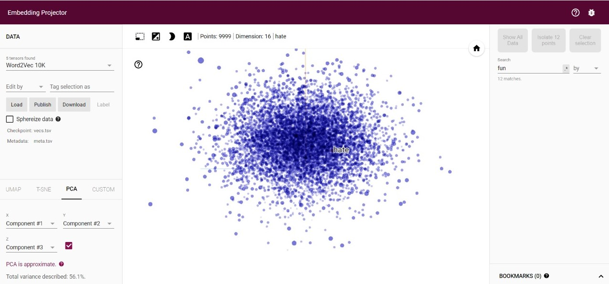
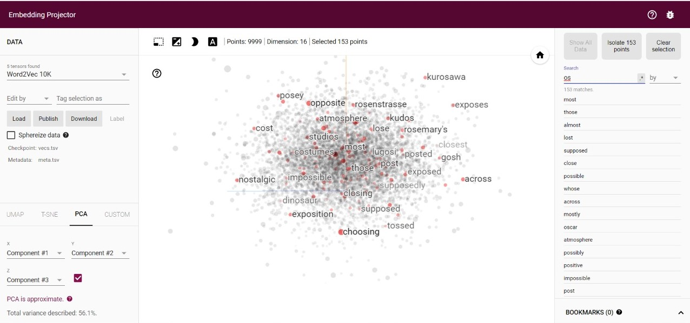
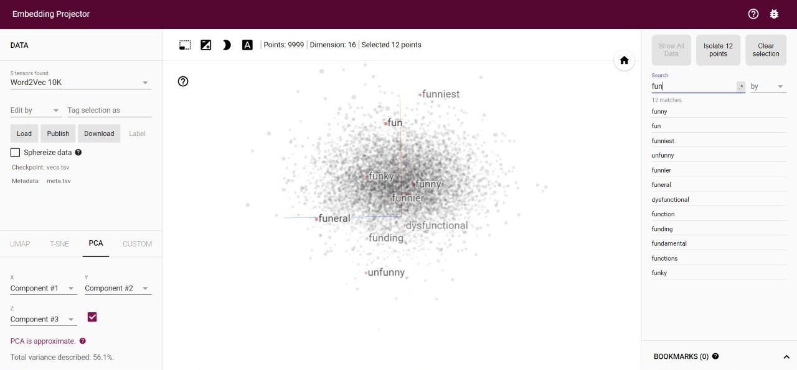

<h1 align="center">IMDB MOVIE REVIEWS CLASSIFICATION USING NLP</h1>

<h3>ACCURACY ON TRAINING SET = 100%</h3>

<h3>ACCURACY ON TEST SET = 82.88%</h3>

<h2 align="center">EMBEDDING RESULTS</h2>

<h3>ALL EMBEDDING RESULTS</h3>

<h3>SELECTING SOME LETTERS</h3>

<h3>SELECTED `FUN`</h3>

